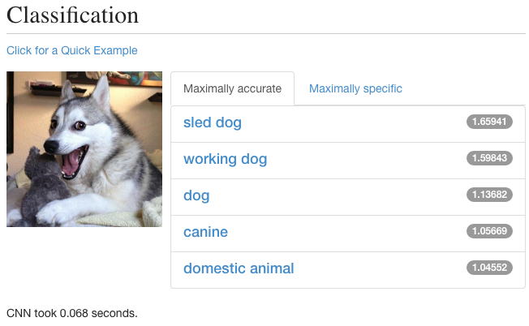
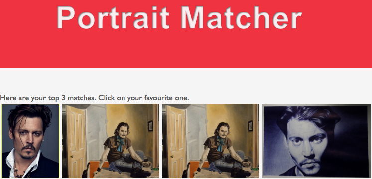

# Caffe2

Caffe2 is a deep learning framework made with expression, speed, and modularity in mind. It is an experimental refactoring of [Caffe](http://caffe.berkeleyvision.org/), and allows a more flexible way to organize computation.

## What Is Deep Learning?

Deep learning is one of the latest advances in Artificial Intelligence and computer science in general. It many ways it is the next generation of machine learning and often works hand-in-hand with existing machine learning processing.

To better understand what Caffe is and how you can use it, we have provided a few examples of machine learning and deep learning in practice today.

### Audio Recognition

Most readers will have been exposed to Apple's Siri. This digital assistant's core interaction with users is through voice recognition. You ask Siri for directions, to make appointments on your calendar, and to look up information. Its uncanny ability to understand a variety of accents in English, let alone its multilingual settings and capabilities, is fairly astonishing when compared to navigating the incredibly frustrating phone trees for your cable company who also use some variation of voice recognition. This wasn't always the case. When Apple launched Siri there was significant criticism of Siri's ability to accurately interpret what people were asking her. It was at about the same frustration level as the aforementioned telecom system. Apple [recently revealed](https://backchannel.com/an-exclusive-look-at-how-ai-and-machine-learning-work-at-apple-8dbfb131932b#.eiae77d82) that many of the enhancements made in Siri since 2014, in comparison to its launch, were accomplished by utilization of Deep Neural Networks (DNN), Convolutional Neural Networks, and other advances in machine learning.

### Digital Assistants & Chat Bots

Ultimately looking at a digital assistant like Siri you might be reminiscent of 2001's HAL computer, one of pop culture's first introductions to Artificial Intelligence. Rather than focus on the AI's homicidal hijinks, other properties are more relevant to understand what you can do with AI and DNN today. The AI was able to *see* though video cameras and *feel* environmental conditions by reading sensors such and temperature, pressure, and velocity. It was able to control doors, engines, and other devices through actuators or other networked parts of the space station. As we explore the full impact and capabilities of the Internet of Things (IoT) where everything communicates: from your fridge, to your security system, to individual lights, you can see that we're not far off from useful interaction with simple AI's. Some simple AI's that we're seeing now are chat bots.

A chat bot could be in action when you click on the support link on your bank's website or favorite shopping website. The "how may I help you?" response can fully a fully automated program that reads your text and looks for related responses, or in the most simplest form redirects you to the appropriate live agent. As the more complex bots are written using deep neural networking, their ability to understand your statements, and more importantly, the context, they'll be able to hold longer more meaningful conversations without you even realizing you weren't chatting with a real person.

### Computer Vision

Computer vision has been around for many years and has enabled advanced robotics, streamlined manufacturing, better medical devices, just to name a few positives, and even license plate recognition to automate giving people tickets for a number of moving violations like speeding, running red lights, and toll violations. Neural networks have significantly improved computer vision applications. A couple of examples are photo processing for object recognition (is that a cat or a dog?), and video processing to automate scene classification or people recognition (is that a helicopter? Is there a person in the scene? Who is that person?).

### Translation

Another useful application of neural networks is with translation between languages. This can be though voice, text, or even handwriting. One of the [tutorials](tutorials.html) with Caffe2 shows how you can create a basic neural network that can identify handwriting of English text with over 95% accuracy. It is not only highly accurate, it is extremely fast.

### IoT

Referring back to the IoT systems such as lighting and security, a fairly simple AI can automatically (and in real-time) review security camera footage, faceprint visitors to distinguish between homeowner, guest, and trespasser, and adjust lighting and music, or flashing lights and alarm sounds accordingly. How the system distinguishes between parties can be accomplished by training a DNN and then a variety of systems such as AWS's IoT platform can wrap this core detector to provide responses and actions.

### Medical

Customs agencies have use [thermal image processing](https://www.ncbi.nlm.nih.gov/pmc/articles/PMC3016318/) to identify people who may be suffering from a fever in order to enforce quarantines and limit the spread of infection disease.

Image segmentation is a common task for in medical imaging to help identify different types of tissue, scan for anomalies, and provide assistance to physicians analyzing imagery in a variety of disciplines such as radiology and oncology.
Medical records can be processed with ML and DNN to find insights and correlations in these massive data sets.    

### Advertising

Outdoor advertising agencies have experimented with systems that identify the gender of the passerby and displays an advertisement that [targets their specific gender](http://www.psfk.com/2015/06/astra-beer-gender-detection-billboard-advertises-to-women.html). This can be done with many types of identifiers such as race, age, clothing, height, weight, mood, and so forth. Several models for these kinds of identifiers have already been created in Caffe and can be used off-the-shelf. Here is an example for [age and gender classification](https://gist.github.com/GilLevi/c9e99062283c719c03de).

## Deep Learning is for Everyone

Deep learning and neural networks can be applied to ANY problem. It excels at handling large data sets, facilitating automation, image processing, and statistical and mathematical operations, just to name a few areas. It can be applied to any kind of operation and can help find opportunities, solutions, and insights. Depending on your role you may find a different attractor for Caffe2 and deep learning.

- Business person - how can it make my company money, save costs, increase margins, find new markets or opportunities
- Marketing person - find new markets, target within markets, increase effectiveness of marketing, personalization
- Product person - enhance products or even create new products with AI and NN at its core
- Data person - analyze massive quantities of data to find trends and predictors, and develop new models for any industry
- Developers & engineers - ultimately there will be demand from so many industry sectors to utilize deep learning that incorporating it into platforms will be required even if you're not involved with creating, researching, or refining the deep learning systems themselves
- Academics - refinement of existing models, creation of new models, algorithm development, and more intelligent neural networks are forthcoming and there's a wide open arena of opportunities for academics to help progress DNN and AI.

## Why Use Caffe2?

Deep Learning does amazing things and the purpose of Caffe2 is to provide an easy and straight-forward way for developers to try it out and come up with their own uses for it. In some cases you may want to use existing models and skip the whole "learning" step and get familiar with the utility and effectiveness of deep learning before trying train your own model.

Some highlights of Caffe models from the [Caffe model zoo](https://github.com/BVLC/caffe/wiki/Model-Zoo):

- [Age and Gender](https://github.com/BVLC/caffe/wiki/Model-Zoo#models-for-age-and-gender-classification)
- [Cars](https://github.com/BVLC/caffe/wiki/Model-Zoo#googlenet_cars-on-car-model-classification)
- [Celebrity Faces](https://github.com/BVLC/caffe/wiki/Model-Zoo#vgg-face-cnn-descriptor)
- [Face to Painting Matching Demo](http://www.robots.ox.ac.uk/~vgg/research/face_paint/)

## Philosophy

Quoting the original Caffe project's [Philosophy](http://caffe.berkeleyvision.org/tutorial/):

> In one sip, Caffe is brewed for

> * Expression: models and optimizations are defined as plaintext schemas instead of code.

> * Speed: for research and industry alike speed is crucial for state-of-the-art models and massive data.

> * Modularity: new tasks and settings require flexibility and extension.

> * Openness: scientific and applied progress call for common code, reference models, and reproducibility.

> * Community: academic research, startup prototypes, and industrial applications all share strength by joint discussion and development in a BSD-2 project.

> and these principles direct the project.

## Getting Started with Caffe2

When you are first getting started with deep learning and Caffe it will help to understand the workflow of how you will create and deploy your deep learning application. Even if you just want to try it out and use existing models and demos you will likely want to use both of these parts, however it is possible to take a model that was previously created and utilize it. At a high-level view, you are looking at two primary stages of working with an deep learning application built with Caffe:

1. Creating your model which will learn from your inputs and information (classifiers) about the inputs and expected outputs.
2. Running the finished model elsewhere, like on a smart phone, or as sub-component of a platform or a larger app.

Creating the model usually takes some significant processing power and time. While you can get away with just using your laptop's CPU to create and train your deep learning neural network with Caffe, you may find that for more complicated models with a lot of inputs that this takes too long. Fortunately, you can use the power of GPUs to massively speed up this process. On method of development is to work with a subset of data on your standard PC or small cloud instance, but then run the training of the model with all of the data on a cloud instance with large GPU capacity.

Running the model ends up being relatively lightweight in the sense that even if you took millions of images as inputs, the output that is used when running is much smaller. For example, using 50,000 images as inputs might have been several GBs of data, but the output model might only be 200 MB.

### Demos

Want to see some examples of how deep learning works without doing all of the setup? Try out some demos:

#### [Caffe Neural Network for Image Classification](http://demo.caffe.berkeleyvision.org/classify_url?imageurl=http%3A%2F%2Fi1.kym-cdn.com%2Fentries%2Ficons%2Foriginal%2F000%2F014%2F959%2FScreenshot_116.png)

#### [Portrait Matcher](http://zeus.robots.ox.ac.uk/facepainting/)

## [Installation](installation.html)

Caffe2's modules are currently written in Python 2 with support for Python 3 coming in the near future.
Installation and compilation [instructions](installation.html) are provided for:

- [MacOSx](installation.html#installing-and-building-caffe2-compilation-macosx)
- [Ubuntu](installation.html#installing-and-building-caffe2-compilation-ubuntu)
- [Docker Support](installation.html#installing-and-building-caffe2-compilation-docker-support)

## Contributing to Caffe2

Caffe is an Open Source project and we really hope to foster innovation and collaboration.

### Bug Reporting

If you find a bug please file an [Issue](https://github.com/caffe2/caffe2/issues), and if you fix said bug, file a [Pull Request](https://github.com/caffe2/caffe2/pulls) referencing the issue.

### Features  

If you want to add or discuss a new feature then you should create a post in the forum and assure at least some discussion before submitting a "blind" pull request.

### Pre-trained Models

Have you created the greatest model since Cindy Crawford? Or maybe the best image categorization model since VGG Team's ILSVRC14 16-layer model? How about a video to text translation model that is more accurate than all before it and it supports 5 languages? Whatever that awesome thing is that you made, share it, and we can put it in [Caffe2's Model Zoo](zoo.html)! Instructions for submissions are on the [Zoo](zoo.html) page.

## License and Citation

Caffe2 is released under the [BSD 2-Clause license](license.html).
=======
---
layout: home
title: Caffe 2
id: home
---

  <h3>Feature 1</h3>
  

    

      
    

    

      
    

  

  <h3>Feature 2</h3>
  

    

      
    

    

      
    

  

  <h3>Feature 3</h3>
  

    

      
    

    

      
    

  

  <h3>Feature 4</h3>
  

    

      
    

    

      
    

  

